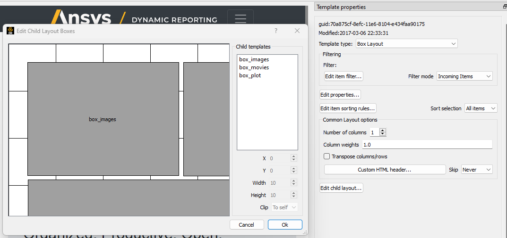
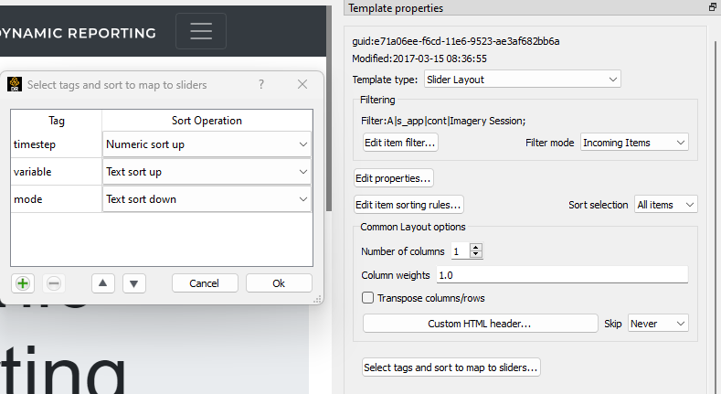
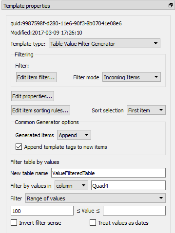

.. _TemplateREST:

Template Objects
================

.. _here: https://s3.amazonaws.com/www3.ensight.com/nexus_docs/nexus_sphinx/is/LayoutTemplates.html
.. _link: https://s3.amazonaws.com/www3.ensight.com/nexus_docs/nexus_sphinx/is/QueryExpressions.html
.. _Columns: https://s3.amazonaws.com/www3.ensight.com/nexus_docs/nexus_sphinx/is/Columns.html
.. _Panel: https://s3.amazonaws.com/www3.ensight.com/nexus_docs/nexus_sphinx/is/Panel.html
.. _Boxes: https://s3.amazonaws.com/www3.ensight.com/nexus_docs/nexus_sphinx/is/Boxes.html
.. _Tabs: https://s3.amazonaws.com/www3.ensight.com/nexus_docs/nexus_sphinx/is/Tabs.html
.. _Carousel: https://s3.amazonaws.com/www3.ensight.com/nexus_docs/nexus_sphinx/is/Carousel.html
.. _Slider: https://s3.amazonaws.com/www3.ensight.com/nexus_docs/nexus_sphinx/is/Slider.html
.. _Page Footer: https://s3.amazonaws.com/www3.ensight.com/nexus_docs/nexus_sphinx/is/PageFooter.html
.. _Page Header: https://s3.amazonaws.com/www3.ensight.com/nexus_docs/nexus_sphinx/is/PageHeader.html
.. _Iterator: https://s3.amazonaws.com/www3.ensight.com/nexus_docs/nexus_sphinx/is/Iterator.html
.. _Tag to Properties: https://s3.amazonaws.com/www3.ensight.com/nexus_docs/nexus_sphinx/is/TagProperties.html
.. _Table of Contents: https://s3.amazonaws.com/www3.ensight.com/nexus_docs/nexus_sphinx/is/TableofContents.html
.. _Link Report: https://s3.amazonaws.com/www3.ensight.com/nexus_docs/nexus_sphinx/is/LinkedReport.html
.. _Table Merge: https://s3.amazonaws.com/www3.ensight.com/nexus_docs/nexus_sphinx/is/TableMerge.html
.. _Table Reduction: https://s3.amazonaws.com/www3.ensight.com/nexus_docs/nexus_sphinx/is/TableReduction.html
.. _Table Row/Column Filter: https://s3.amazonaws.com/www3.ensight.com/nexus_docs/nexus_sphinx/is/TableRowColumnFilter.html
.. _Table Value Filter: https://s3.amazonaws.com/www3.ensight.com/nexus_docs/nexus_sphinx/is/TableValueFilter.html
.. _Table Row/Column Sort: https://s3.amazonaws.com/www3.ensight.com/nexus_docs/nexus_sphinx/is/TableRowColumnSort.html
.. _SQL Query: https://s3.amazonaws.com/www3.ensight.com/nexus_docs/nexus_sphinx/is/SQLQuery.html
.. _Tree Merge: https://s3.amazonaws.com/www3.ensight.com/nexus_docs/nexus_sphinx/is/TreeMerge.html
.. _Userdefined: https://s3.amazonaws.com/www3.ensight.com/nexus_docs/nexus_sphinx/is/Userdefined.html
.. _Generator templates: https://s3.amazonaws.com/www3.ensight.com/nexus_docs/nexus_sphinx/is/GeneratorTemplates.html

report_objects.TemplateREST object
----------------------------------

This object is a Python representation of an Ansys
Dynamic Reporting template object. When
this object is created, a GUID will automatically be generated for the
object and the date is set to the current time/date. The
report_objects.TemplateREST class represent features common to all
template types. Two sub-classes, report_objects.LayoutREST and
report_objects.GeneratorREST represent the generic Layout and Generator
templates. From each of these classes, a set of sub-classes representing
the specific template types are inherited. For information specific to
each template type, refer to the :ref:`subclass tree <ReportObjectsList>`.

.. note::

    TemplateREST objects should always be generated using the
    server object :doc:`create_template() <ServerObject>` method.

Data members
^^^^^^^^^^^^

The following attributes are available on a TemplateREST object:

-  guid - string GUID. The default is **str(uuid.uuid1())**
-  tags - The user-defined tags string for this object. Multiple tags
   are space-separated. You can also access the tabs via the method
   :ref:`get_tags() <template_get_tags>`.
-  date - The time & date of the creation of this object. The default
   is: **datetime.datetime.now(pytz.utc)**
-  name - The name of the template
-  report_type - The type of the report template (e.g. 'Layout:basic').
   The report_type is also set by the sub-class of the object. See
   :ref:`this table <template_type_table>` for the
   correspondence between report_type and template sub-class
-  item_filter - The filter string for this report template. You can
   also access the filter via the method
   :ref:`get_filter() <template_get_filter>`.
-  params - A Python dictionary of the parameters for this specific
   report_type. You can also access the parameters via the method
   :ref:`get_params() <template_get_params>`.
-  children - A list of the child templates of this template
-  master - True if the parent data member is None
-  parent - The parent template (if any) of this template

Methods
^^^^^^^

.. _template_get_params:

**template.get_params()**

Get the parameters of the template.

The parameter field contains all the fields that can be set via the GUI,
including filters, list of properties, individual settings for the
specific template type. While one can access all the values via this
method, we would suggest using the methods specific to the field you are
interested in for each field for sake of clarity and usability.

**template.set_params({'param1': 1})**

Set the parameters of the template. This function takes as input a
dictionary.

The parameter field contains all the fields that can be set via the GUI,
including filters, list of properties, individual settings for the
specific template type. While one can access all the values via this
method, we would suggest using the methods specific to the field you are
interested in for each field for sake of clarity and usability.

**template.add_params({'param1': 1})**

Add the parameters to the existing template parameters. This function
takes as input a dictionary.

The parameter field contains all the fields that can be set via the GUI,
including filters, list of properties, individual settings for the
specific template type. While one can access all the values via this
method, we would suggest using the methods specific to the field you are
interested in for each field for sake of clarity and usability.

**template.get_property()**

Get the properties of the template as a dictionary. A general
description of what properties are for a template can be found
`here`_.

**template.set_property(property={})**

Set the properties of the template. Input needs to be a dictionary. A
general description of what properties are for a template can be found
`here`_.

**template.add_property(property={})**

Add the properties of the template. Input needs to be a dictionary. A
general description of what properties are for a template can be found
`here`_.

**template.get_sort_fields()**

Get the sorting filter of the template.

**template.set_sort_fields(['+i_date', '-i_name'])**

Set the sorting filter of the template. This function takes a list as
input. The list is generated with '+' for increasing, '-' for
decreasing, followed by the property to sort by, with the same strings
as reported at this `link`_. Example: setting the sort
fields to be by increasing item date and decreasing by item name
becomes: ['+i_date', '-i_name']

**template.add_sort_fields(['+i_date', '-i_name'])**

Add elements to the sorting filter of the template. This function takes
a list as input. The list is generated with '+' for increasing, '-' for
decreasing, followed by the property to sort by, with the same strings
as reported `link`_. Example: setting the sort
fields to be by increasing item date and decreasing by item name
becomes: ['+i_date', '-i_name']

**template.get_sort_selection()**

Get the sort selection parameter.

**template.set_sort_selection(value="all")**

Set the sort selection parameter for the template.This function takes a
string as input, among the following options:

-  'all'
-  'first'
-  'last'

**template.set_tags(tagstring)**

Set the tags for the template to the passed string. Multiple tags are
space-separated.

.. _template_get_tags:

**template.get_tags()**

Returns the tags string for this object. Multiple tags are
space-separated.

**template.add_tag(tag, value=None)**

Adds a tag to the current tag string. If no value is passed, the simple
tag string is added to the tags string. If a value is specified, a
string of the form tag=value will be added to the tag string.

**template.rem_tag(tag)**

Remove the tag (and any potential associated value) from the current tag
string.

.. _template_get_filter:

**template.get_filter()**

Get the item filter of the template. The item filter is encoded as a
string using the format explained `link`_.

**template.set_filter(filter_str='')**

Sets the item filter of the template. Takes as input a string. The item
filter is encoded as a string using the format explained
`link`_.

**template.add_filter(filter_str='')**

Add filters to the item filter of the template. Takes as input a string.
The item filter is encoded as a string using the format explained
`link`_.

**template.get_filter_mode()**

Returns the filter mode of the template. The possible outputs are:

-  'items': corresponds to Incoming Items
-  'root_replace': corresponds to Database (replace)
-  'root_append': corresponds to Database (append)

**template.set_filter_mode(value='items')**

Sets the filter mode of the template. Takes as input a string. See
get_filter_mode for the accepted values.

Example of usage. Let's assume you want to create a template like the
one shown in the picture (from the documentation example in the
Ansys Dynamic Reporting installer):

.. figure:: lib/NewItem306.png
   :alt: Image
   :align: center

Let's also assume you want this template to be a root-level template
(i.e.: that doesn't have a parent template) in the database running
locally on port 8000. These would be the lines of code to create the new
template:

.. code-block:: python

   from ansys.dynamicreporting.core.utils import report_remote_server, report_objects

   server = report_remote_server.Server("http://localhost:8000", "nexus", "cei")
   all_reports = server.get_objects(objtype=report_objects.TemplateREST)
   my_template = server.create_template(
       name="Example Template", parent=None, report_type="Layout:panel"
   )
   my_template.set_filter("A|i_src|cont|build_imagery;A|i_tags|cont|timestep=10;")
   my_template.set_property({"width": "50"})
   server.put_objects(my_template)

SubClasses
^^^^^^^^^^

Each template type is represented by a subclass of the TemplateREST
class. There are two main subclasses: LayoutREST for the Layout template
types and GeneratorREST for the Generator template types. Each of these
subclasses has its own set of subclasses, to represent each specific
template type.

.. _template_type_table:

======================= ============================= ========================================
**Layouts**             **Template type**             **Template API sub-class**
======================= ============================= ========================================
basic                   `Columns`_                    :ref:`report_objects.basicREST()
                                                      <basicREST>`

panel                   `Panel`_                      :ref:`report_objects.panelREST()
                                                      <panelREST>`

box                     `Boxes`_                      :ref:`report_objects.boxREST()
                                                      <boxREST>`

tabs                    `Tabs`_                       :ref:`report_objects.tabsREST()
                                                      <tabsREST>`

carousel                `Carousel`_                   :ref:`report_objects.carouselREST()
                                                      <carouselREST>`

slider                  `Slider`_                     :ref:`report_objects.sliderREST()
                                                      <sliderREST>`

footer                  `Page Footer`_                :ref:`report_objects.footerREST()
                                                      <footerREST>`

header                  `Page Header`_                :ref:`report_objects.headerREST()
                                                      <headerREST>`

iterator                `Iterator`_                   :ref:`report_objects.iteratorREST()
                                                      <iteratorREST>`

tagprops                `Tag to Properties`_          :ref:`report_objects.tagpropsREST()
                                                      <tagpropsREST>`

toc                     `Table of Contents`_          :ref:`report_objects.tocREST()
                                                      <tocREST>`

reportlink              `Link Report`_                :ref:`report_objects.reportlinkREST()
                                                      <reportlinkREST>`

userdefined             `Userdefined`_                :ref:`report_objects.userdefinedREST()
                                                      <userdefinedREST>`
======================= ============================= ========================================

======================= ============================= ========================================
**Generators**          **Template type**             **Template API sub-class**
======================= ============================= ========================================
tablemerge              `Table Merge`_                :ref:`report_objects.tablemergeREST()
                                                      <tablemergeREST>`

tablereduce             `Table Reduction`_            :ref:`report_objects.tablereduceREST()
                                                      <tablereduceREST>`

tablerowcolumnfilter    `Table Row/Column Filter`_    :ref:`report_objects.tablerowcolumnfilterREST()
                                                      <tablerowcolumnfilterREST>`

tablevaluefilter        `Table Value Filter`_         :ref:`report_objects.tablevaluefilterREST()
                                                      <tablevaluefilterREST>`

tablesortfilter         `Table Row/Column Sort`_      :ref:`report_objects.tablesortfilterREST()
                                                      <tablesortfilterREST>`

sqlqueries              `SQL Query`_                  :ref:`report_objects.sqlqueriesREST()
                                                      <sqlqueriesREST>`

treemerge               `Tree Merge`_                 :ref:`report_objects.mergetreeREST()
                                                      <mergetreeREST>`
======================= ============================= ========================================

.. _LayoutREST:

LayoutREST class
^^^^^^^^^^^^^^^^

Inherits from TemplateREST

Class that groups all the common attributes among Layout templates
(for reference, see `here`_). Its specific methods are:

**template.get_column_count()**

Get the number of columns.

**template.set_column_count(value)**

Set the number of columns. Takes as input an integer larger than 0.

**template.get_column_widths()**

Get the list of the widths of the columns.

**template.set_column_widths([1.0, 2.0, 1.0])**

Set the list of the widths of the columns. Takes as input an array where
each number represent the relative width of that column compared to the
other columns.

**template.get_transpose()**

Returns the Transpose columns/rows status of the template. It returns 0
for off, 1 for on. It supports only Layout: template types.

**template.set_transpose(value=0)**

Sets the Transpose columns/rows status of the template. value = 0 for
off, value = 1 for on. It supports only Layout: template types.

**template.get_skip()**

Returns the Skip if no input items status of the template. It returns 0
for off, 1 for on. It supports only Layout: template types.

**template.set_skip(value=0)**

Sets the Skip if no input items status of the template. value = 0
(default) for off, value = 1 for on. It supports only Layout: template
types.

**template.get_html()**

Returns the HTML of the template. It supports only Layout: template
types

**template.set_html(value=None)**

Sets the HTML of the template. Takes as input a string. It supports only
Layout: template types.

Example of usage. Let's assume you want to create a template like the
one shown in the picture (from the "Slider Example" template in the
documentation example in the Ansys Dynamic Reporting installer):

.. figure:: lib/NewItem307.png
   :alt: Image
   :align: center

Let's also assume you want this template to be a root-level template
(i.e.: that doesn't have a parent template) in the database running
locally on port 8000. These would be the lines of code to create the new
template:

.. code-block:: python

   from ansys.dynamicreporting.core.utils import report_remote_server, report_objects

   server = report_remote_server.Server("http://localhost:8000", "nexus", "cei")
   all_reports = server.get_objects(objtype=report_objects.TemplateREST)
   my_template = server.create_template(
       name="Slider Example", parent=None, report_type="Layout:panel"
   )
   my_template.set_column_count(2)
   my_template.set_column_widths([1.0, 1.0])
   * my_template.set_html("<h2>Example Slider Panels</h2>キャンペー")
   server.put_objects(my_template)

.. _GeneratorREST:

GeneratorREST class
^^^^^^^^^^^^^^^^^^^

Inherits from TemplateREST

Class that groups all the common attributes among
`Generator templates`_. Its specific methods are:

**template.get_generated_items()**

Get the Generated items flag. Returned values:

-  'replace': corresponds to Replace
-  'add': corresponds to Append

**template.set_generated_items(value)**

Get the Generated items flag. Takes as input a string. See
get_generated_items() for the acceptable strings.

**template.get_append_tags()**

Get the value for Append template tags to new items. Returned values are
True for toggled ON, False for toggled OFF

**template.set_append_tags(value=True)**

Get the value for Append template tags to new items. The input needs to
be a boolean: True / False

.. _basicREST:

basicREST object
^^^^^^^^^^^^^^^^

Inherits from TemplateREST, LayoutREST

Class that corresponds to the `Columns`_ Layout template
type. No specific methods.

.. _panelREST:

panelREST object
^^^^^^^^^^^^^^^^

Inherits from TemplateREST, LayoutREST

Class that corresponds to the `Panel`_ Layout template type.
Its specific methods are:

**template.get_panel_style()**

Get the style of the Panel. Possible returned values:

-  'panel': corresponds to Titled Panel
-  'callout-default': corresponds to Callout
-  'callout-danger': corresponds to Callout Error
-  'callout-warning': corresponds to Callout Warning
-  'callout-success': corresponds to Callout Success
-  'callout-info': corresponds to Callout Info

**template.set_panel_style(value='panel')**

Set the style of the Panel. Takes as input strings. For the acceptable
values, see get_panel_style()

**template.get_items_as_link()**

Get the Show items as link toggle. 0 corresponds to Off, 1 corresponds
to ON.

**template.set_items_as_link(value=0)**

Set the Show items as link toggle. Takes as input an integer. 0
corresponds to Off, 1 corresponds to ON.

.. _boxREST:

boxREST object
^^^^^^^^^^^^^^

Inherits from TemplateREST, LayoutREST

Class that corresponds to the `Boxes`_ Layout template type.
Its specific methods are:

**template.get_children_layout()**

Get the children layout. This method returns a dictionary where each
entry is a different child layout.

For each entry, the key corresponds to the guid of the child template.
The corresponding value is an array that gives::

   [ X, Y, Width, Height, Clip]

where Clip has the following values:

-  'self': corresponds to Clip: To self
-  'scroll': corresponds to Clip: Scroll
-  'none': corresponds to Clip: None

**template.set_child_position(guid=None, value=[0,0,10,10])**

Set the children layout: position and size. The method takes as input
the guid of the child template you want to modify, and an array of 4
integers that corresponds to [X, Y, Width, Height] that you want to
set.
Remember that if you are setting a new child template (not modifying
an existing one), you will manually need to set that this child
template has the current box template as the parent template. See the
example below for how to do it.

**template.set_child_clip(guid=None, clip='self')**

Set the children layout: clip parameter. The method takes as input the
guid of the child template you want to modify, and the clip type as a
string. Only the types enumerated in get_children_layout() are
acceptable values.
Remember that if you are setting the clip type for a new child
template (not modifying an existing one), you will manually need to
set that this child template has the current box template as the
parent template. See the example below for how to do it.

Example of usage. Let's assume you want to create a template like the
one shown in the picture (from the documentation example in the
Ansys Dynamic Reporting installer):

Let's also assume you want this template to be a child template of the
template "Box report test" that already exists in in the database
running locally on port 8000. These would be the lines of code to create
the new template:

.. code-block:: python

   from ansys.dynamicreporting.core.utils import report_remote_server, report_objects

   server = report_remote_server.Server("http://localhost:8000", "nexus", "cei")
   all_reports = server.get_objects(objtype=report_objects.TemplateREST)
   my_parent = [x for x in all_reports if x.name == "Box reporttest"][0]
   my_template = server.create_template(
       name="Box Template", parent=my_parent, report_type="Layout:box"
   )

   first_box = [x for x in all_reports if x.name == "box_images"][0]
   my_template.set_child_position(guid=first_box.guid, value=[40, 39, 320, 240])
   first_box.parent = my_template.guid
   second_box = [x for x in all_reports if x.name == "box_movies"][0]
   my_template.set_child_position(guid=second_box.guid, value=[370, 39, 355, 241])
   my_template.set_child_clip(guid=second_box.guid, clip="scroll")
   second_box.parent = my_template.guid
   third_box = [x for x in all_reports if x.name == "box_plot"][0]

   my_template.set_child_position(guid=third_box.guid, value=[41, 288, 685, 210])
   my_template.set_child_clip(guid=third_box.guid, clip="none")
   third_box.parent = my_template.guid

   server.put_objects([first_box, second_box, third_box])
   server.put_objects(my_template)
   server.put_objects(my_parent)

.. _tabsREST:

tabsREST object
^^^^^^^^^^^^^^^

Inherits from TemplateREST, LayoutREST

Class that corresponds to the `Tabs`_ Layout template type. No
specific methods for this class.

.. _carouselREST:

carouselREST object
^^^^^^^^^^^^^^^^^^^

Inherits from TemplateREST, LayoutREST

Class that corresponds to the `Carousel`_ Layout template
type. Its specific methods are:

**template.get_animated()**

Get the Animated value. If the toggle is OFF (default), the method will
return 0. This means that the Carousel doesn't automatically change
displayed image, and the user needs to click to see the next item.

A non-zero integer value means the Carousel will automatically change
displayed image. The value represents how long each image is displayed
for in ms.

**template.set_animated(value=0)**

Set the Animated value. For an explanation of what this parameter
represents, see the get_animated() method above.

**template.get_slide_dots()**

Get the Include side dots value. If zero (default), the method returns
1.  If the number of side dots is larger than the number of items
displayed on the Carousel, a number of dots corresponding to the number
of items will be displayed. If the number of side dots is smaller than
the number of items displayed on the Carousel, it is ignored an no dots
are displayed.

**template.set_slide_dots(value=20)**

Set the Include side dots value. For an explanation of what this
parameter represents, see the get_side_dots() method above.

.. _sliderREST:

sliderREST object
^^^^^^^^^^^^^^^^^

Inherits from TemplateREST, LayoutREST

Class that corresponds to the `Slider`_ template
type. Its specific methods are:

**template.get_map_to_slider()**

Get the Selected tags and sort to map to sliders. This function returns
a list where each element corresponds to one tag and its sorting order.
The accepted sorted orders are:

-  'text_up': corresponds to Text sort up
-  'text_down': corresponds to Text sort down
-  'numeric_up': corresponds to Numeric sort up
-  'numeric_down': corresponds to Numeric sort down
-  'none': corresponds to No sorting

An example of output of this function is: ['tag1|text_up',
'tag2|numeric_down', 'tag3|none'] where the slider is sorted by "tag1"
using the "Text sort up" sorting method, then by "tag2" using the
"Numeric sort down" method and finally by "tag3" using no sorting
method.

**template.set_map_to_slider(value=[])**

Set the Selected tags and sort to map to sliders. This function takes as
input a list where each element corresponds to one tag and its sorting
order. See function get_map_to_slider() for the accepted sorting order
values. The input for this function will have form:

['tag1|text_up', 'tag2|numeric_down', 'tag3|none']

**template.add_map_to_slider(value=[])**

Add new tags and sorting methods to the the Selected tags and sort to
map to sliders. This function takes as input a list where each element
corresponds to one tag and its sorting order. See function
get_map_to_slider() for the accepted sorting order values. The input for
this function will have form:

['tag1|text_up', 'tag2|numeric_down', 'tag3|none']

Example of usage. Let's assume you want to create a template like the
one shown in the picture (from the "Basic Slider" template in the
documentation example in the Ansys Dynamic Reporting installer):

Let's also assume you want this template to be a child of the template
"Tabs" in the database running locally on port 8000. These would be the
lines of code to create the new template:

.. code-block:: python

   from ansys.dynamicreporting.core.utils import report_remote_server, report_objects

   server = report_remote_server.Server("http://localhost:8000", "nexus", "cei")
   all_reports = server.get_objects(objtype=report_objects.TemplateREST)
   my_parent = [x for x in all_reports if x.name == "Tabs"][0]
   my_template = server.create_template(
       name="Basic Slider", parent=my_parent, report_type="Layout:slider"
   )
   my_template.set_filter("A|s_app|cont|Imagery Session;")
   my_template.set_map_to_slider(
       ["timestep|numeric_up", "variable|text_up", "mode|text_down"]
   )
   server.put_objects(my_template)
   server.put_objects(my_parent)

.. _footerREST:

footerREST object
^^^^^^^^^^^^^^^^^

Inherits from TemplateREST, LayoutREST

Class that corresponds to the `Page Footer`_ Layout
template type. No specific methods.

.. _headerREST:

headerREST object
^^^^^^^^^^^^^^^^^

Inherits from TemplateREST, LayoutREST

Class that corresponds to the `Page Header`_ Layout
template type. No specific methods.

.. _iteratorREST:

iteratorREST object
^^^^^^^^^^^^^^^^^^^

Inherits from TemplateREST, LayoutREST

Class that corresponds to the `Iterator`_ template
type. Its specific methods are:

**template.get_iteration_tags()**

Get the values for Iteration tag and Secondary sorting tag. The values
are returned as element 0 and 1 of a list.

**template.set_iteration_tags(value = ['', ''])**

Set the values for Iteration tag and Secondary sorting tag. The input
values are given as element 0 and 1 of a list, and they need to be
strings

**template.get_sort_tag()**

Get the values for Sort items by tag and Reverse the sort as booleans.
The values are returned as element 0 and 1 of a list.

**template.set_sort_tag(value=[True, False])**

Set the values for Iteration tag and Secondary sorting tag. The values
are given as a list of booleans. Note that if you set the first element
to False, the second will automatically be set to False as well,
regardless of what the input is.

.. _tagpropsREST:

tagpropsREST object
^^^^^^^^^^^^^^^^^^^

Inherits from TemplateREST, LayoutREST

Class that corresponds to the `Tag to Properties`_
Layout template type. No specific methods.

.. _tocREST:

tocREST object
^^^^^^^^^^^^^^

Inherits from TemplateREST, LayoutREST

Class that corresponds to the `Table of Contents`_
Layout template type. Its specific methods are:

**template.get_toc()**

Get the values for Table of Contents, Figure List and Table List. Only
one option can be ON at any given time. The function will return a
string that corresponds to the option that is toggled on:

-  'toc': corresponds to Table of Contents option
-  'figure': corresponds to the Figure List option
-  'table': corresponds to the Table List option

If none of these option is ON (default when the template is created),
then the method will return None.

**template.set_toc(option='toc')**

Set the values for Table of Contents, Figure List and Table List. Only
one can be ON at any given time. Only the following values for option
are accepted:

-  'toc': toggles on the Table of Contents option
-  'figure': toggles on the Figure List option
-  'table': toggles on the Table List option

.. _reportlinkREST:

reportlinkREST object
^^^^^^^^^^^^^^^^^^^^^

Inherits from TemplateREST, LayoutREST

Class that corresponds to the `Link Report`_ Layout
template type. Its specific methods are:

**template.get_report_link()**

Get the guid of the linked report. If no linked report, it will return
None

**template.set_report_link(link=None)**

Set the guid of the linked report. It takes as input a valid guid. If
you want to set to link to no report, set the input to None

.. _userdefinedREST:

userdefinedREST object
^^^^^^^^^^^^^^^^^^^^^^

Inherits from TemplateREST, LayoutREST

Class that corresponds to the `Userdefined`_ Layout
template type. This template inserts a named div into the HTML output.
This div can be filled with any HTML the user would like.  By default,
the HTML content will be filled in with the ``TemplateREST.set_html()``
content (if any).  This content may be placed before or after any
child item/layout content.

Specific properties include:

**template.interactive_only: int**

If this property is set to a non-zero value (the default), then the
div will not be included when ADR is outputting PDF, PowerPoint or
Offline HTML.  If set to zero, it will be included in PDF and Offline
HTML output.

**template.before_children: int**

If this property is set to zero (the default), then any child content
is placed in the report before the div.  If set to a non-zero value, the
children will be placed in the report after the div.

**template.userdef_name: str**

This property is used to specify the value of the div ``adr_userdefined_template``
attribute.  The default value is ``unspecified``.

For example, if this property is set to ``"Hello"`` and the HTML is set
to ``<h1>Example</h1>`` the generated div will look like this:

.. code-block:: html

    

    <h1>Example</h1>
    

.. _tablemergeREST:

tablemergeREST object
^^^^^^^^^^^^^^^^^^^^^

Inherits from TemplateREST, GeneratorREST

Class that corresponds to the `Table Merge Generator`
template type. Its specific methods are:

**template.get_merging_param()**

Get the value of Merging. Possible outputs are:

-  'row': corresponds to Rows
-  'column': corresponds to Columns

**template.set_merging_param(value='row')**

Set the value of Merging. Input needs to be a string: either "row" or
"column".

**template.get_table_name()**

Get the value of Resulting table name.

**template.set_table_name(value = '')**

Set the value of Resulting table name. Input should be a string.

**template.get_sources()**

Get the values of the Select source rows/columns. The output is a list
where each element is a different source. Each element has the following
form: 'row_name|merge_operation' where merge_operation can have one of
the following values:

-  'duplicate': corresponds to Allow Duplicates
-  'merge': corresponds to Combine Values
-  'rename_tag': corresponds to Rename Using Only Tag
-  'rename_nametag': corresponds to Rename With Name and Tag

**template.set_sources(value=[])**

Set the values of the Select source. The input needs to be a list where
each element is a different source, with the form explained in the
get_sources() method section.

**template.add_sources(value=[])**

Add some values to the Select source. The input needs to be a list where
each element is a different source, with the form explained in the
get_sources() method section.

**template.get_rename_tag()**

Get the value of the Tag to use when renaming field. Output will be a
string.

**template.set_rename_tag(value='')**

Set the value of the Tag to use when renaming field. Input should be a
string.

**template.get_rename_tag()**

Get the value of the Tag to use when renaming field. Output will be a
string.

**template.set_rename_tag(value='')**

Set the value of the Tag to use when renaming field. Input should be a
string.

**template.get_use_labels()**

Get the value of the toggle for Use row/column labels as row/column IDs.
Output is 0 for toggled OFF, 1 for toggled ON.

**template.set_use_labels(value=1)**

Set the value of the toggle for Use row/column labels as row/column IDs.
Input should be an integer: 0 for toggled OFF, 1 for toggled ON.

**template.get_use_ids()**

Get the value for the Row/Column to use as column/row IDs field.

**template.set_use_ids(value='')**

Set the value for the Row/Column to use as column/row IDs field. Input
should be a string. This method will not work if get_use_labels()
returns 1.

**template.get_id_selection()**

Get the value for the Row/Column ID selection. The possible outputs are:

-  'all': corresponds to All IDs
-  'intersect': corresponds to Only Common IDs
-  'select': corresponds to Select Specific IDs

**template.set_id_selection(value='all')**

Set the value for the Row/Column ID selection. Input should be a string
among the ones listed in the get_id_selection() method.

**template.get_ids()**

Get the value for the Select column/row IDs values. If the Column/Row ID
selection is not set to Select Specific IDs, it will return an empty
list. Otherwise, it will return a list where each element is an ID.

**template.set_ids(value=[])**

Set the value for the Select column/row IDs values. If the Column/Row ID
selection is not set to Select Specific IDs, the method will bail out.
The input is a list, where each element is an ID as an integer.

**template.add_ids(value=[])**

Add IDs to the Select column/row IDs values. If the Column/Row ID
selection is not set to Select Specific IDs, the method will bail out.
The input is a list, where each element is an ID as an integer.

**template.get_unknown_value()**

Get the value for Unknown value. It returns a string. Default is 'nan'.

**template.set_unknown_value(value='nan')**

Set the value for the Unknown value. Input needs to be a string.

**template.get_table_transpose()**

Get the value for Transpose results. Output is an integer: 0 for OFF, 1
for ON.

**template.set_table_transpose(value=0)**

Set the value for Transpose results. Input must be an integer: 0 for
OFF, 1 for ON.

**template.get_numeric_output()**

Get the value for Force numeric table output. Output is an integer: 0
for OFF, 1 for ON.

**template.set_numeric_output(value=0)**

Set the value for Force numeric table output. Input must be an integer:
0 for OFF, 1 for ON.

Example of usage. Let's assume you want to create a template like the
one shown in the picture (from the "Merged Table" template in the
documentation example in the Ansys Dynamic Reporting installer):

.. figure:: lib/NewItem309.png
   :alt: Image
   :align: center

Let's also assume you want this template to be a child of the template
"Columns" in the database running locally on port 8000. These would be
the lines of code to create the new template:

.. code-block:: python

   from ansys.dynamicreporting.core.utils import report_remote_server, report_objects

   server = report_remote_server.Server("http://localhost:8000", "nexus", "cei")
   all_reports = server.get_objects(objtype=report_objects.TemplateREST)
   my_parent = [x for x in all_reports if x.name == "Columns"][0]
   my_template = server.create_template(
       name="Merged Table", parent=my_parent, report_type="Generator:tablemerge"
   )
   my_template.set_generated_items("replace")
   my_template.set_table_name("Simple_test")
   my_template.set_sources(["temperature|rename_nametag", "Distance|merge"])
   my_template.set_rename_tag("\_index\_")
   my_template.set_use_labels(0)
   my_template.set_use_ids("Distance")
   server.put_objects(my_template)
   server.put_objects(my_parent)

.. _tablereduceREST:

tablereduceREST object
^^^^^^^^^^^^^^^^^^^^^^

Inherits from TemplateREST, GeneratorREST

Class that corresponds to the `Table Reduction`_
Generator template type. Its specific methods
are:

**template.get_reduce_param()**

Get the value of Reduce. Possible outputs are:

-  'row': corresponds to Rows
-  'column': corresponds to Columns

**template.set_reduce_param(value='row')**

Set the value of Reduce. Input needs to be a string: either "row" or
"column".

**template.get_table_name()**

Get the value of Resulting table name.

**template.set_table_name(value = 'output_table')**

Set the value of Resulting table name. Input should be a string.

**template.get_operations()**

Get the values for the Reduce operations as a list. Each element
corresponds to a different operation. Each element is a dictionary,
where the following keys are presented:

-  'source_rows': corresponds to the name(s) of the rows/columns used in
   the operation
-  'output_rows': corresponds to the Output row/column name
-  'output_rows_from_values': False (OFF) / True (ON) for the Use unique
   values from a column/row as column/row names
-  'output_column_select': corresponds to the "Select columns/rows"
   field
-  'output_columns': corresponds to the Column/Row name field
-  'output_columns_from_values': False (OFF) / True (ON) for the Use
   unique values from a column/row as a new columns/rows toggle
-  'operation': corresponds to the Operation field. Possible values:

   -  'min': Minimum
   -  'max': Maximum
   -  'count': Count
   -  'sum': Sum
   -  'diff': Difference
   -  'mean': Mean
   -  'stdev': Standard deviation
   -  'skew': Skew
   -  'kurtosis': Kurtosis

**template.delete_operation(name = [])**

Method to remove an entire Reduce operation. Takes as input a list with
the name(s) of the source rows/columns used in the operation. So for
example to delete the third Reduce operation from the following panel:

.. figure:: lib/NewItem293.png
   :alt: Image
   :align: center

use:

.. code-block:: python

   template.delete_source(name=["temperature", "pressure"])

To delete the first operation, use:

.. code-block:: python

   template.delete_source(name=["temperature"])
   template.add_operation(
       name=["\*"],
       unique=False,
       output_name="output row",
       existing=True,
       select_names="\*",
       operation="count",
   )

Add a new Reduce operation.

-  'name': corresponds to the name(s) of the rows/columns used in the
   operation. Input needs to be a list of strings
-  'unique': corresponds to the Use unique values from a column as row
   names toggle. False is OFF, True is ON
-  output_name: corresponds to the Output row/column name.
-  existing: corresponds to the Use existing columns/rows toggle. False
   if OFF, True is ON.
-  select_names. If existing is set to True, it is used for the Selected
   columns/rows field. If existing is set to False, this field is used
   for the Column/Row name.
-  operation: corresponds to the operation field. See get_operation()
   for the acceptable values.

For example to create the operation in the following widget:

.. figure:: lib/NewItem294.png
   :alt: Image
   :align: center

you would run:

.. code-block:: python

   template.add_operation(
       name=["temperature"],
       unique=True,
       output_name="MinTemp",
       existing=False,
       select_names="simulationA",
       operation="min",
   )
   template.get_table_transpose()

Get the value for Transpose results. Output is an integer: 0 for OFF, 1
for ON.

**template.set_table_transpose(value=0)**

Set the value for Transpose results. Input must be an integer: 0 for
OFF, 1 for ON.

**template.get_numeric_output()**

Get the value for Force numeric table output. Output is an integer: 0
for OFF, 1 for ON.

**template.set_numeric_output(value=0)**

Set the value for Force numeric table output. Input must be an integer:
0 for OFF, 1 for ON.

Example of usage. Let's assume you want to create a template like the
one shown in the picture (from the "ASCII reduce" template in the
documentation example in the Ansys Dynamic Reporting installer):

.. figure:: lib/NewItem310.png
   :alt: Image
   :align: center

Let's also assume you want this template to be a child of the template
"Merge reduce example" in the database running locally on port 8000.
These would be the lines of code to create the new template:

.. code-block:: python

   from ansys.dynamicreporting.core.utils import report_remote_server, report_objects

   server = report_remote_server.Server("http://localhost:8000", "nexus", "cei")
   all_reports = server.get_objects(objtype=report_objects.TemplateREST)
   my_parent = [x for x in all_reports if x.name == "Merge reduce example"][0]
   my_template = server.create_template(
       name="ASCII reduce", parent=my_parent, report_type="Generator:tablereduce"
   )
   my_template.set_generated_items("replace")
   my_template.delete_operation(name=["\*"])
   my_template.add_operation(
       name=["\*"],
       unique=True,
       output_name="User",
       existing=False,
       select_names="Version",
       operation="count",
   )
   my_template.add_operation(
       name=["\*"],
       unique=False,
       output_name="Totals",
       existing=False,
       select_names="Version",
       operation="count",
   )
   server.put_objects(my_template)
   server.put_objects(my_parent)

.. _tablerowcolumnfilterREST:

tablerowcolumnfilterREST object
^^^^^^^^^^^^^^^^^^^^^^^^^^^^^^^

Inherits from TemplateREST, GeneratorREST

Class that corresponds to the `Table Row/Column Filter`_
Generator template type. Its specific
methods are:

**template.get_table_name()**

Get the value of New table name.

**template.set_table_name(value = 'output_table')**

Set the value of New table name. Input should be a string.

**template.get_filter_rows()**

Get the value of Rows... The values are returned as a list of strings,
where each element corresponds to a row value.

**template.set_filter_rows(value=['\*'])**

Set the value of Rows... The input value needs to be a list of strings,
where each element corresponds to a different row value.

**template.add_filter_rows(value=['\*'])**

Add new values to the value of Rows... The input value needs to be a
list of strings, where each element corresponds to a different row
value.

**template.get_filter_columns()**

Get the value of Columns... The values are returned as a list of
strings, where each element corresponds to a column value.

**template.set_filter_columns(value=['\*'])**

Set the value of Columns... The input value needs to be a list of
strings, where each element corresponds to a different column value.

**template.add_filter_columns(value=['\*'])**

Add new values to the value of Columns... The input value needs to be a
list of strings, where each element corresponds to a different column
value.

**template.get_invert()**

Get the value of Select the rows/columns to remove. Returns 0 or False
if it is toggled OFF, 1 or True if it is toggled ON

**template.set_invert(value=False)**

Set the value of Select the rows/columns to remove. Set it to 0 or False
to toggle OFF, set to 1 or True to toggle ON

**template.get_sort()**

Get the value of Sort rows/columns by selection order. Returns 0 or
False if it is toggled OFF, 1 or True if it is toggled ON

**template.set_sort(value=False)**

Set the value of Sort rows/columns by selection order. Set it to 0 or
False to toggle OFF, set to 1 or True to toggle ON. This method works
only if the Select the rows/columns to remove is toggled OFF.

**template.get_table_transpose()**

Get the value of Transpose the output table. Returns 0 or False if it is
toggled OFF, 1 or True if it is toggled ON

**template.set_table_transpose(value=False)**

Set the value of Transpose the output table. Set it to 0 or False to
toggle OFF, set to 1 or True to toggle ON

Example of usage. Let's assume you want to create a template like the
one shown in the picture (from the "Filter" template in the
documentation example in the Ansys Dynamic Reporting installer):

.. figure:: lib/NewItem311.png
   :alt: Image
   :align: center

Let's also assume you want this template to be a child of the template
"RC Filter Generator" in the database running locally on port 8000.
These would be the lines of code to create the new template:

.. code-block:: python

   from ansys.dynamicreporting.core.utils import report_remote_server, report_objects

   server = report_remote_server.Server("http://localhost:8000", "nexus", "cei")
   all_reports = server.get_objects(objtype=report_objects.TemplateREST)
   my_parent = [x for x in all_reports if x.name == "RC Filter Generator"][0]
   my_template = server.create_template(
       name="Filter", parent=my_parent, report_type="Generator:tablerowcolumnfilter"
   )
   my_template.set_filter_rows(["0", "fuselage", "\*wing\*"])
   my_template.set_filter_columns(["1", "Tria3", "Tetra\*"])
   my_template.set_table_name("RC_Filtered_Table")
   server.put_objects(my_template)
   server.put_objects(my_parent)

.. _tablevaluefilterREST:

tablevaluefilterREST object
^^^^^^^^^^^^^^^^^^^^^^^^^^^

Inherits from TemplateREST, GeneratorREST

Class that corresponds to the `Table Value Filter`_
Generator template type. Its specific methods
are:

**template.get_table_name()**

Get the value of New table name.

**template.set_table_name(value = 'value filtered table')**

Set the value of New table name. Input should be a string.

**template.get_filter_by()**

Get the value of Filter by values in as a list. The first element is
'column' (default) or 'row'. The second element of the list of the
number of row/column set in the following field.

**template.set_filter_by(value = ['column', '0'])**

Set the value of Filter by values in as a list. The first element needs
to be 'column' or 'row'. The second element of the list of the number of
row/column set in the following field, and needs to be a string.

**template.get_filter_value()**

Get the value of Filter. Each different type of filter will return a
different type of output:

-  'Range of values': it returns a list of three elements. The first
   element is 'range'. The second and third are strings that represent
   the min. and max. of the range.
-  'Specific values': it returns a list of two elements. The first
   element is "specific". The second element is a list of strings. Each
   element in this second list is one entry in the Select specific
   values... field
-  'Upper % of values': it returns a list of two elements. The first
   element is "top_percent". The second element is a float that
   corresponds to the Upper percent of values field.
-  'Upper # of values': it returns a list of two elements. The first
   element is "top_count". The second element is an integer that
   corresponds to the Upper number of values field.
-  'Lower % of values': it returns a list of two elements. The first
   element is "bot_percent". The second element is a float that
   corresponds to the Lower percent of values field.
-  'Lower # of values': it returns a list of two elements. The first
   element is "bot_count". The second element is an integer that
   corresponds to the Lower number of values field.

**template.set_filter_value(value=['range', '', ''])**

Set the value of Filter. Each different type needs a different type of
input. See the description of get_filter_value() possible outputs to know the
details of the accepted formats.

**template.get_invert_filter()**

Get the value of Invert filter sense. Returns 0 or False if it is
toggled OFF, 1 or True if it is toggled ON

**template.set_invert_filter(value=False)**

Set the value of Invert filter sense. Set it to 0 or False to toggle
OFF, set to 1 or True to toggle ON

**template.get_values_as_dates()**

Get the value of Treat values as dates. Returns 0 or False if it is
toggled OFF, 1 or True if it is toggled ON

**template.set_values_as_dates(value=False)**

Set the value of Treat values as dates. Set it to 0 or False to toggle
OFF, set to 1 or True to toggle ON

Example of usage. Let's assume you want to create a template like the
one shown in the picture (from the documentation example in the
Ansys Dynamic Reporting installer):

Let's also assume you want this template to be a child template of the
template "Value Filter Example" that already exists in in the database
running locally on port 800. These would be the lines of code to create
the new template:

.. code-block:: python

   from ansys.dynamicreporting.core.utils import report_remote_server, report_objects

   server = report_remote_server.Server("http://localhost:8000", "nexus", "cei")
   all_reports = server.get_objects(objtype=report_objects.TemplateREST)
   my_parent = [x for x in all_reports if x.name == "Value Filter Example"][0]
   my_template = server.create_template(
       name="Generator", parent=my_parent, report_type="Generator:tablevaluefilter"
   )
   my_template.set_sort_selection(value="first")
   my_template.set_table_name("ValueFilteredTable")
   my_template.set_filter_by(value=["row", "Quad4"])
   my_template.set_filter_value(value=["range", "100", ""])
   server.put_objects(my_template)
   server.put_objects(my_parent)

.. _tablesortfilterREST:

tablesortfilterREST object
^^^^^^^^^^^^^^^^^^^^^^^^^^

Inherits from TemplateREST, GeneratorREST

Class that corresponds to the `Table Row/Column Sort`_
Generator template type. Its specific methods
are:

**template.get_table_name()**

Get the value of New table name.

**template.set_table_name(value = 'value filtered table')**

Set the value of New table name. Input should be a string.

**template.get_sort_rows()**

Get the Select columns to sort rows by. This returns a list where each
element is a filter. Each elements start with '+' or '-' to indicate the
direction of the sort, and the string of the row name to sort by.

**template.set_sort_rows([])**

Set the Select columns to sort rows by. This function takes a list as
input. The list is generated with '+' for increasing, '-' for
decreasing, followed by the row to sort by. Example: setting the sort
fields to be by increasing row "temperature" and decreasing by row
"pressure" becomes: ['+temperature', '-pressure']

**template.add_sort_rows([])**

Add the Select columns to sort rows by. This function takes a list as
input. See set_sort_rows() for the description on how the list has to be
formatted.

**template.get_sort_columns()**

Get the Select rows to sort columns by. This returns a list where each
element is a filter. Each elements start with '+' or '-' to indicate the
direction of the sort, and the string of the column name to sort by.

**template.set_sort_columns([])**

Set the Select rows to sort columns by. This function takes a list as
input. See set_sort_rows() for the description on how the list has to be
formatted.

**template.add_sort_columns([])**

Add the Select rows to sort columns by. This function takes a list as
input. See set_sort_rows() for the description on how the list has to be
formatted.

Example of usage. Let's assume you want to create a template like the
one shown in the picture (from the "Sorted" template in the
documentation example in the Ansys Dynamic Reporting installer):

.. figure:: lib/NewItem313.png
   :alt: Image
   :align: center

Let's also assume you want this template to be a child of the template
"RC Sort Filter Example" in the database running locally on port 8000.
These would be the lines of code to create the new template:

.. code-block:: python

   from ansys.dynamicreporting.core.utils import report_remote_server, report_objects

   server = report_remote_server.Server("http://localhost:8000", "nexus", "cei")
   all_reports = server.get_objects(objtype=report_objects.TemplateREST)
   my_parent = [x for x in all_reports if x.name == "RC Sort Filter Example"][0]
   my_template = server.create_template(
       name="Sorted", parent=my_parent, report_type="Generator:tablesortfilter"
   )
   my_template.set_sort_rows(["+User", "+Version", "+Date"])
   my_template.set_generated_items("replace")
   my_template.set_sort_columns(["+Labels"])
   server.put_objects(my_template)
   server.put_objects(my_parent)

.. _sqlqueriesREST:

sqlqueriesREST object
^^^^^^^^^^^^^^^^^^^^^

Inherits from TemplateREST, GeneratorREST

Class that corresponds to the `SQL Query`_ Generator
template type. Its specific methods are:

**template.get_db_type()**

Get the Database type. Possible outputs are: SQLite / PostgreSQL

**template.set_db_type(value='SQLite')**

Set the Database type. Input needs to be a string. Only two acceptable
values: 'SQLite' or 'PostgreSQL'

**template.get_sqlite_name()**

Get the SQLite filename.

**template.set_sqlite_name(value='')**

Set the SQLite filename. Input needs to be a string. The method will not
work if the Database type is set to PostgreSQL

**template.get_postgre()**

Get the PostgreSQL parameters. This method returns a dictionary with
five entries, corresponding to:

-  Database name:
-  Hostname:
-  Port:
-  Username:
-  Password:

**template.set_postgre(value = {'database'**: '',
'hostname':'localhost', 'port': '5432', 'username':'nexus',
'password':'cei'}\ **)**

Set the the PostgreSQL parameters. Input needs to be a dictionary with
the keys: 'database', 'hostname', 'port', 'username', 'password'. Note
that all keys are strings. See get_postgre() method for the description
of each element. The method will not work if the Database type is set to
SQLite

**template.get_query()**

Get theSQL query text: field.

**template.set_query(value='')**

Set theSQL query text: field. Input needs to be a string. Note that no
check on the validity of the SQL query itself is performed. It is up to
the user to make sure the query is properly formatted.

**template.validate()**

Validate the database. This method should be run after all the
parameters for the database connection have been set. The method
returns:

-  Boolean parameter: True is the database can be validated, False
   otherwise.
-  Error message: If the connection is validated, this will be an empty
   string. Otherwise, and error message with more details about the
   failure will be returned.

.. _mergetreeREST:

mergetreeREST object
^^^^^^^^^^^^^^^^^^^^

Inherits from TemplateREST, GeneratorREST

Class that corresponds to the `Tree Merge`_ Generator
template type. Its specific methods are:

**template.get_merge_rule()**

Get the row merging rule.

**template.set_merge_rule(value='all')**

Set the row merging rule. Legal values: 'all', 'common', 'first'

**template.get_match_rule()**

Get the rule for matching rows.

**template.set_match_rule(value='both')**

Set the rule for matching rows. Legal values: 'key', 'name', 'both'

**template.get_tree_name()**

Get the name that the generated tree will be given.

**template.set_tree_name(value='treemerge')**

Set the name that the generated tree will be given. Input needs to be a
string.

**template.get_fill_value()**

Get the value to be used to fill unknown cells.

**template.set_fill_value(value='')**

Set the value to be used to fill unknown cells. Input needs to be a
string.

**template.get_header_tag()**

Get the name of the tag (if any) to be used to generate an output tree
header.

**template.set_header_tag(value='')**

Set the name of the tag to be used to generate an output tree header.
Input needs to be a string. An empty string (the default) specifies that
no tree header be generated.
